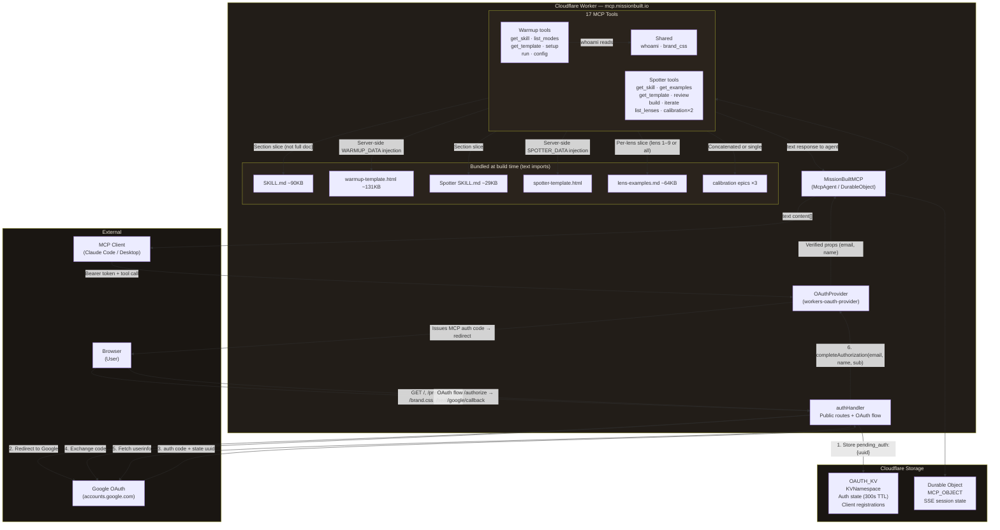
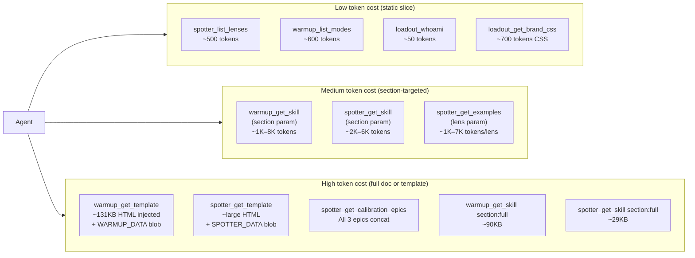

# Architecture — The Loadout (missionbuilt-mcp)
*Generated by tech-lead-review · 2026-05-16*

## Data and Token Flow

## Token / Cost Flow

## Design Notes

**What this is:** A Cloudflare Worker implementing an OAuth-protected MCP server. The Worker serves public HTML pages (landing, preview, brand.css) and protected MCP tools for two skills — The Warmup (intelligence briefs) and The Spotter (epic review).

**Key architectural decisions:**

1. **Bundled skill content** — All markdown and HTML skill content is imported as text at build time via Wrangler `[[rules]] type = "Text"`. This eliminates runtime I/O, puts content in Worker memory, and makes it instantly available without any storage read on the critical path.

2. **Server-side template injection** — `warmup_get_template` and `spotter_get_template` inject `WARMUP_DATA`/`SPOTTER_DATA` server-side before returning the HTML. This replaces a fragile Write→Read→Edit cycle where agents were generating their own HTML from training memory.

3. **Section-based skill loading** — `getSkillSection()` and `getSpotterSkillSection()` slice the large SKILL.md files by markdown heading boundaries, letting agents load only the section they need. Warmup SKILL.md is ~90KB; typical agent calls load 1–8KB.

4. **OAuth via workers-oauth-provider** — The library handles RFC 8414 discovery, dynamic client registration, token issuance, and PKCE. The custom code handles only Google sign-in as the identity provider.

**Known tradeoffs:**

- `brandCss()` is called on every request rather than being memoized — small CPU cost, no correctness issue.
- Version constants (`SERVER_VERSION`, `WARMUP_VERSION`, `WARMUP_ENGINE_VERSION`, `SPOTTER_VERSION`) are scattered across files and must be kept in sync manually.
- `/mcp` Streamable HTTP transport is advertised in landing.ts but not registered in `OAuthProvider` — only `/sse` is protected and functional.

**Areas flagged for improvement:**

- XSS: `spotter_get_template` lacks the `</script>` escape that `warmup_get_template` correctly applies.
- Prompt injection: `warmup_config` and `warmup_run` inline user-controlled strings into agent instructions without sanitization.
- `OAUTH_PROVIDER: any` in the `Env` interface drops type safety for the most security-critical binding.
- Landing page tool count (14) is stale — actual count is 17.
