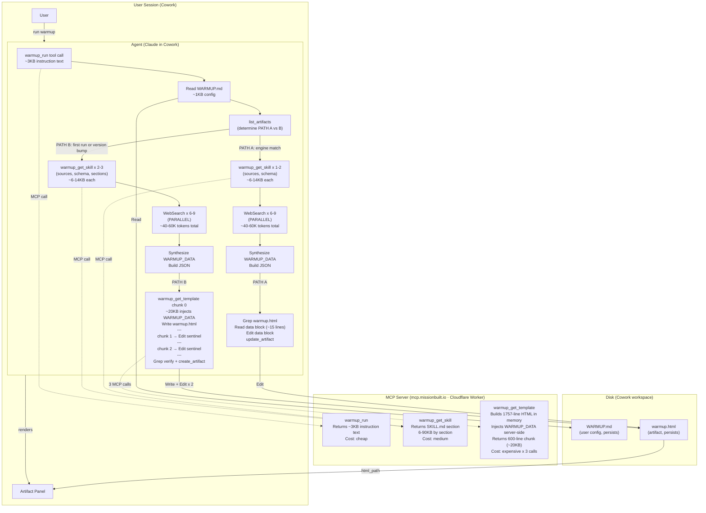

# Architecture — The Loadout (Warmup PATH B Focus)
*Generated by tech-lead-review · 2026-05-18*

## Data and Token Flow

## PATH A vs PATH B Cost Comparison

| | PATH A (daily, engine match) | PATH B (first run / version bump) |
|---|---|---|
| Trigger | engine marker matches WARMUP_ENGINE_VERSION | No artifact, or version mismatch |
| MCP tool calls | warmup_run + 1-2 warmup_get_skill | warmup_run + 2-3 warmup_get_skill + 3x warmup_get_template |
| File ops | Grep + Read (~15 lines) + Edit | Write + 2x Edit + Grep |
| Token cost (fetch) | ~40-60K (WebSearch, parallel) | ~40-60K (WebSearch, parallel) |
| Token cost (render) | ~1-2KB targeted patch | ~60KB (3 chunks at ~20KB each) |
| Wall time estimate | 45-90 seconds | 2-4 minutes |
| Frequency | Every daily run after first | Once per user + every WARMUP_ENGINE_VERSION bump |

## Known Architectural Constraints

**Cowork 67KB persistence threshold** — MCP responses over 67KB are saved to disk as a JSON envelope by Cowork, making them unreadable via the standard Read tool (single long line exceeds token limits). warmup_get_template returns 600-line chunks (~20KB each) to stay under this threshold. Each chunk is inline in context — no disk read needed.

**Model output token limit (~8K)** — Even if the agent received the full ~131KB HTML string, it could not Write it in one call. Chunked Write + Edit assembly is required regardless of the persistence threshold.

**Session-scoped outputs directory** — The agent's outputs/ directory is ephemeral (cleared between sessions). Warmup artifacts MUST be written to the user's workspace folder. If the agent gets the path wrong, the registered artifact points to a file that disappears after the session — blank panel next time.

**Deferred tool schemas (Cowork)** — list_artifacts, create_artifact, update_artifact are deferred until explicitly loaded. In the observed session transcript, the agent issued a ToolSearch call for create_artifact in the hot path after template assembly. Agents should load artifact tools before starting.

**WARMUP_ENGINE_VERSION bump mechanic** — Bumping forces PATH B on every user's next run, propagating template changes. Keep bumps infrequent — the cost is one extra PATH B run for every active user.

## Design Notes

**Why warmup-shell.rawjs is separate from the HTML skeleton** — The 1700-line renderer is bundled at Wrangler build time and injected into the template at request time. This keeps the template readable and the renderer independently editable.

**Why WARMUP_DATA is injected server-side** — Agents cannot reliably do substring replacement in 131KB strings. The server handles the </script> escape and replacer-function safety ($-sequence protection). Agents pass JSON.stringify(WARMUP_DATA) and receive complete, safe HTML.

**Known debt (see TECH-LEAD-REVIEW.md for full details):**
- P0: SKILL.md Path B still documents the old single-call API (blank artifacts on section:"run" reads)
- P0: Renderer try-catch is too wide — any structural error in WARMUP_DATA = blank white page
- P0: warmup_setup step 6 doesn't call warmup_run — WARMUP_DATA built from training memory
- P1: warmup_get_template description says "400-line chunks" but CHUNK_LINES=600
- P1: 3 sequential warmup_get_skill calls before fetch adds ~15-30s
- P2: CHUNK_LINES 600 -> 900 reduces PATH B from 3 chunks to 2 (saves 2 file ops)
