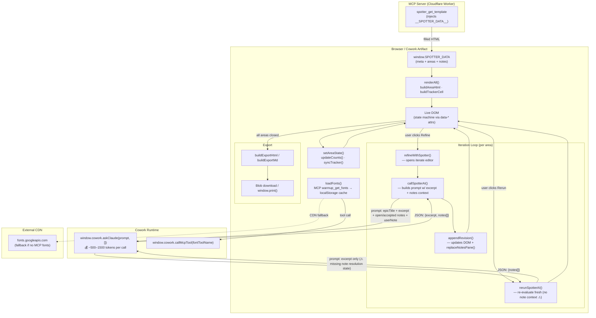

# Architecture — The Spotter Worksheet (v1.0)
*Generated by tech-lead-review · May 20, 2026*

## Data and Token Flow

## Token Cost Notes

| Call | Approx tokens | Frequency |
|------|--------------|-----------|
| `callSpotterAI` | ~500–1500 (excerpt + notes + prompt) | Once per user refine action |
| `rerunSpotterAI` | ~300–800 (excerpt + prompt, no notes) | Once per rerun action |
| `callMcpTool (fonts)` | ~5000+ (full font CSS) | Once per session (cached in localStorage) |

## Known Issues (from review)

- `note.type` from LLM responses is inserted into HTML class attributes without validation — XSS risk via prompt injection (High)
- `rerunSpotterAI` sends no note resolution context to the model (Medium)
- Font cache key is `warmup-fonts-v2` — should be a shared or spotter-specific key (Medium)
- `sendBtn` promise chain has no outer `.catch` — UI can freeze on DOM errors (Medium)
- Dead function `getSelectedNotes` references removed `data-selected` attribute (High)
