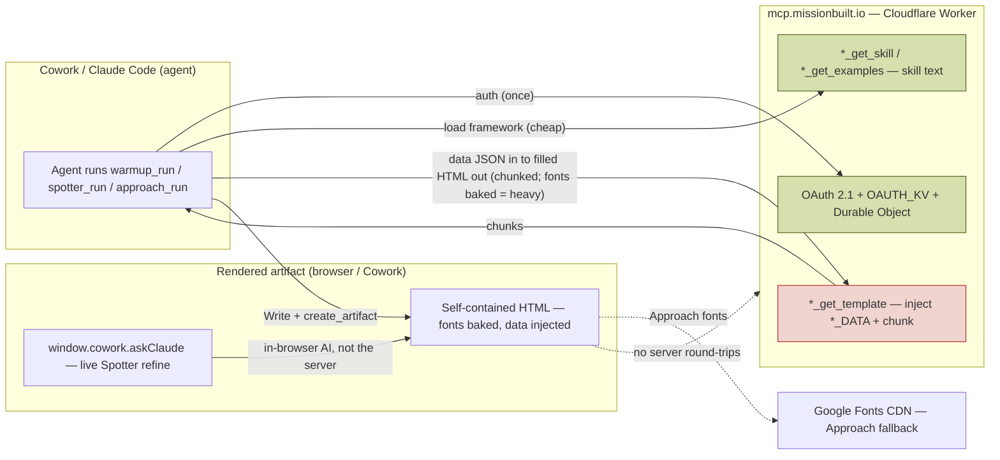

# Tech Lead Review — Loadout thin-server v2 + Spotter standalone
**Stack:** TypeScript · Cloudflare Workers + Durable Objects · MCP SDK · Zod · OAuth 2.1 (Google)
**Files reviewed:** `index.ts`, `auth.ts`, `constants.ts`, `wrangler.toml`, `landing.ts`, `skill-content/{spotter,warmup,the-approach}/*`, `spotter/*` (standalone), `spotter/scripts/inject.py`
**Scope:** the uncommitted W1 (Spotter standalone) + W2 (thin-server) change surface.
**Date:** 2026-06-13

---

## 🔴 Critical (0)

None. No exposed secrets, no injection vulnerability, no data-exposure regression. The change *reduces* server-side data surface.

---

## 🟠 High (0)

None.

---

## 🟡 Medium (2)

### M1 — Baked fonts are streamed through agent context on every render
**Location:** `index.ts` `warmup_get_template` / `spotter_get_template`; `skill-content/{warmup,spotter}/*-template.html`
**Issue:** Both templates inline ~440 KB of base64 `@font-face` data. The template is delivered to the agent in 900-line chunks, so that base64 passes through the agent's context window every render (≈100 K+ tokens/render). Previously the Warmup served fonts via a separate `warmup_get_fonts` tool whose CSS was cached in the browser's `localStorage` and never touched the agent. The Approach deliberately avoids this with a Google Fonts CDN link + system fallback.
**Why it matters:** Real recurring token cost on the daily Warmup and every Spotter run, in exchange for offline self-containment.
**Decision:** Intentional trade for "zero artifact→server round-trips," and matches the proven public standalone build. Keep it — but consciously. If token cost outweighs the offline guarantee for the Warmup, switch the Warmup template to the Approach's CDN+fallback model. No code blocker.

### M2 — Orphaned dead files after the shell retirement
**Location:** `missionbuilt-mcp/src/warmup-shell.rawjs`, `spotter-shell.rawjs`, `approach-shell.rawjs`, `skill-content/warmup/fonts.css`
**Issue:** All imports were removed (`index.ts`, `auth.ts`). They no longer compile into the worker but remain in the tree and hold the only repo references to the removed tools.
**Fix:** `git rm` them (in the handoff block). `approach-shell.rawjs` was already dead pre-change; removing it now is optional.

---

## 🟢 Low / Recommendations (3)

### L1 — Dormant MCP code paths remain in the baked Warmup template
**Location:** `skill-content/warmup/warmup-template.html` (font-loader IIFE, `warmup_get_data` poll)
**Issue:** The self-contained template still carries the old `callMcpTool` font loader and a `get_data` visibility poll. Both are guarded (baked fonts present → loader skips; injected data → poll no-ops) and validated to not fire (jsdom render = no errors, no CDN/MCP calls). Same file proven in the public standalone live runs.
**Fix:** Optional — strip the dead IIFEs in a later pass. Not a runtime risk.

### L2 — Bundled Approach template keeps an MCP font loader
**Location:** `skill-content/the-approach/approach-template.html`
**Issue:** With `warmup_get_fonts` removed, the loader's call is blocked by Cowork → falls back to the CDN link already in `<head>`. Fonts still load; SKILL.md/run prose updated to CDN-only.
**Fix:** None required; degrades gracefully.

### L3 — KV namespace id committed in `wrangler.toml`
**Location:** `wrangler.toml` `OAUTH_KV` `id`
**Issue:** A Cloudflare KV namespace id is a resource identifier, not a credential — standard to commit.
**Fix:** None.

---

## ✅ Clean

- **Template injection safety:** `warmup_get_template` / `spotter_get_template` mirror the proven `approach_get_template` — `JSON.parse` validation, `</script>` escape, replacer-function injection (no `$`-expansion), `.max(300_000)` bound on the data param (closes the prior unbounded-`spotter_data` backlog item). XSS further mitigated by `esc()` on every field at render.
- **Secrets:** none hardcoded; no tokens/keys in the diff.
- **PII:** *reduced* — removing `WARMUP_KV` + `warmup_save_data`/`get_data` eliminates server-side persistence of user briefs keyed by email.
- **Auth boundary:** unchanged; only a public static-JS route (`/spotter-shell.js`) removed, matching the prior `/approach-shell.js` removal.
- **Error messages:** tool errors surface JSON-parse messages and "placeholder missing" — no internal state/stack leakage.
- **Build integrity:** `index.ts` + `auth.ts` pass esbuild TS parse; tool count (18) matches `TOOL_COUNT`; both templates inject + render in jsdom with zero JS errors and zero CDN/MCP references in the Spotter.
- **Offline gating:** Spotter Refine/Send hidden when `askClaude` absent; worksheet degrades to read-only.
- **Elastic / brand scrub:** zero `elastic` across the repo (gitignored personal `WARMUP.md` excluded).

---

## Architecture Diagram

**Trust boundary:** the Worker (OAuth + KV + DO) is the only authenticated surface. Rendered artifacts make **zero** round-trips back to it — the goal of thin-server v2. The expensive call is `*_get_template` (baked-font payload); skill/whoami/brand calls are cheap.

---

## Fix Plan

**P0 — Before shipping:** none.

**P1 — With this commit:**
1. `git rm` the dead shells + `fonts.css` so the tree matches the worker.

**P2 — Schedule:**
1. Decide Warmup fonts: keep baked (offline, higher token cost) vs. CDN+fallback like the Approach (M1).
2. Strip dormant `callMcpTool`/`get_data` IIFEs from `warmup-template.html` (L1) and the dead loader from `approach-template.html` (L2).

---

## Seal of Approval

**Ready to ship — no P0 blockers.** The thin-server collapse is sound: injection is safe and bounded, the change reduces PII surface, and rendered artifacts are genuinely self-contained. Complete the P1 `git rm` with the commit, and keep the M1 baked-font token cost in mind as a conscious trade.
