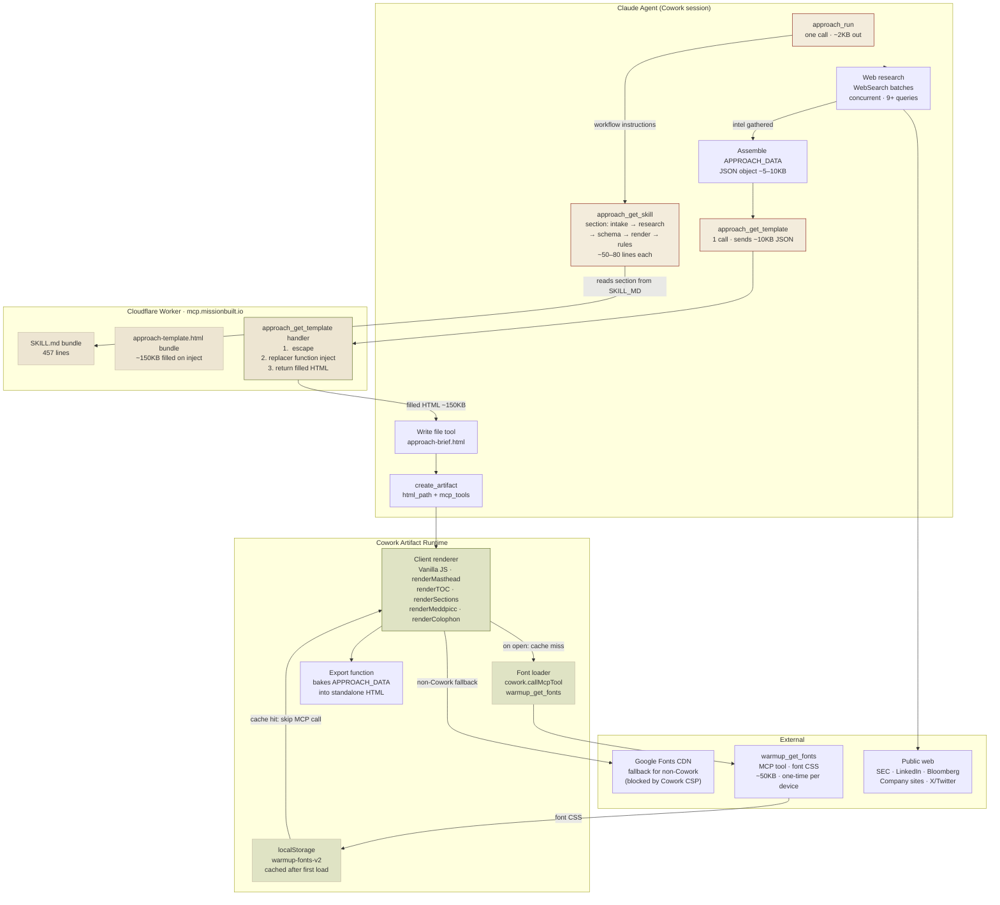

# Architecture — The Approach (v0.2.3)
*Generated by tech-lead-review · 2026-05-20*

## Data and Token Flow



## Token Cost Annotations

| Step | Tokens in | Tokens out | Notes |
|---|---|---|---|
| `approach_run` | ~50 | ~600 | One-time workflow prime |
| `approach_get_skill` × 4–5 | ~100 each | ~500–800 each | Section-gated — loads only what's needed |
| Web research (9+ batches) | ~200/query | ~500/result | Concurrent; most expensive phase |
| `approach_get_template` | ~10K (JSON) | ~150K (HTML) | Largest single response; one call, no retries |
| `create_artifact` | ~200 | ~100 | Metadata only |
| `warmup_get_fonts` (first open) | ~50 | ~50K (CSS) | Cached — subsequent opens: 0 |

## Design Notes

**Single-path render.** Unlike The Warmup (Path A/B based on engine version), The Approach always runs the full flow: data assembly → injection → artifact creation. The right call for a skill that generates a fresh brief per prospect — no stale-cache risk, no version-check overhead.

**Server-side injection pattern.** `approach_get_template` does both safety layers on the server (</script> escaping + replacer function) and returns the complete, self-contained HTML. The agent is a passive courier — it assembles the data object, hands it to the server, and writes the result. The server owns injection safety.

**Font sharing across skills.** The Approach shares the `warmup-fonts-v2` localStorage key with The Warmup and The Spotter. Any skill that loads fonts first covers the others. A user who runs the Warmup daily never pays the font MCP call when opening an Approach brief.

**Known issues (see TECH-LEAD-REVIEW-APPROACH.md for fix plan):**
- Schema mismatches: `pull.quote`, `facts.label/value`, `opener.text/beat`, `meta.generatedAt`, `meta.sourceCount` all documented incorrectly vs. what the renderer reads.
- `renderColophon` reads `C.seller` (undefined); should be `C.config.seller`.
- Question item chips are documented but not rendered.
```
