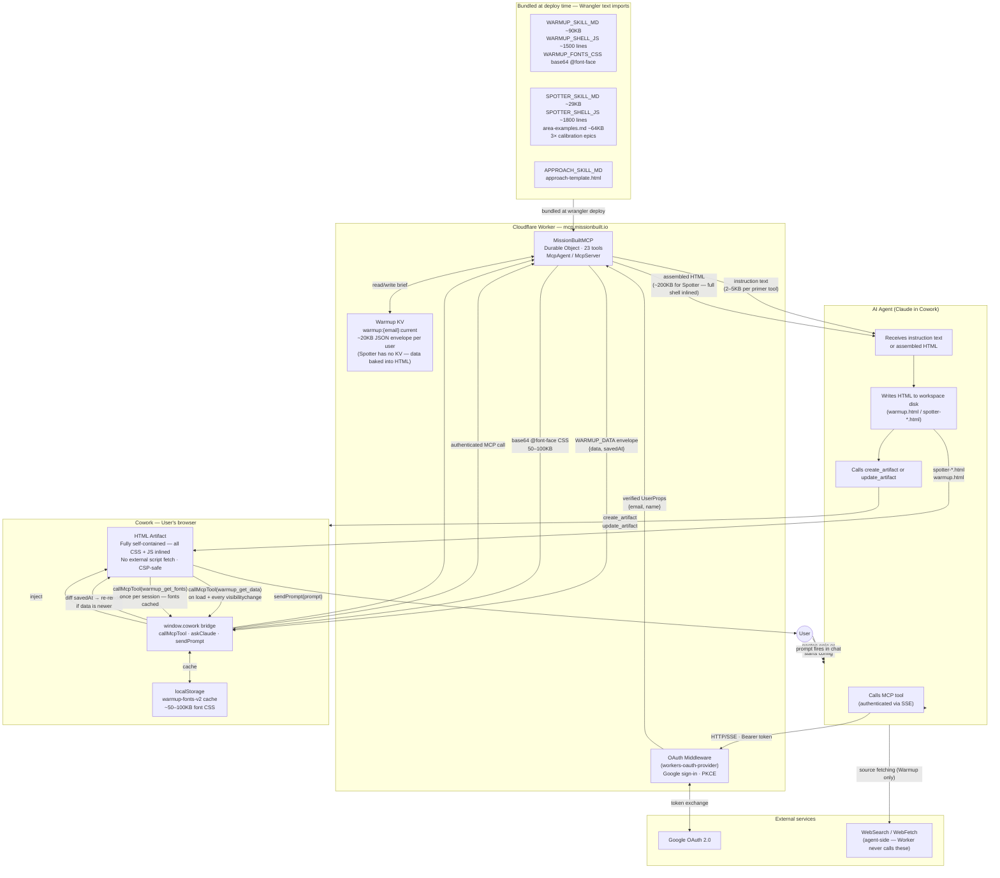

# Architecture — Mission Built MCP (The Spotter + The Warmup)
*Generated by tech-lead-review · 2026-05-19*

## Data and Token Flow

## Warmup vs Spotter — Artifact Architecture

| Aspect | The Warmup | The Spotter |
|---|---|---|
| Data persistence | Cloudflare KV (server-side) | Baked into HTML artifact |
| Artifact refresh | Auto-refresh on every visibilitychange via `warmup_get_data` | Agent rewrites HTML (Path A or Path B) |
| Template delivery | Chunked in 900-line segments (`warmup_get_template chunk:N`) | Single call returns full HTML (~200KB) |
| Path A | Edit `` in data content
2. `function() { return '... <' + '/script>'; }` — replacer function prevents `$&`/`$'`/`` $` `` expansion and splits the closing tag so the source file's HTML parser doesn't close the script block early

**XSS posture (as of v0.7.19):** `esc()` applied to every agent-sourced field before `innerHTML` insertion across all three Spotter render modes (build / transition / review). `jsEsc()` (esc + backslash + quote escaping) used correctly for inline `onclick` string literals. No `safeUrl()` needed in Spotter since all action links use `sendPrompt()` bridge rather than agent-supplied `href`.

**Prompt injection posture:**
- ✅ `spotter_review` (`epic`) — fenced in code block, `.max(20000)` zod guard
- ✅ `spotter_iterate` (`draft`) — fenced in code block, `.max(20000)` zod guard
- ✅ `warmup_run` (`config_summary`) — fenced in code block, sliced to 8000 chars, explanatory comment
- ✅ `warmup_config` (`source`) — sanitized (strip control chars + non-ASCII), 120-char limit, explanatory comment
- ⚠️ `spotter_build` (`feature`) — embedded inline as `**${feature}**`, no `.max()` constraint (P2 fix)

**Auth:** Full OAuth 2.1 PKCE flow via `@cloudflare/workers-oauth-provider`. State stored in KV with 5-min TTL, deleted on first read. Google access token used only for identity lookup, not stored.

**No rate limiting at Worker level:** `/sse` is OAuth-gated. Public routes (`/health`, `/brand.css`) are unprotected but stateless. Cloudflare-level WAF rules can be added externally.

**Observability:** No structured logging in TypeScript source. Cloudflare Workers tail + Logpush is the primary debug surface.

## Version Constants (`src/constants.ts`)

| Constant | Current | Bump when |
|---|---|---|
| `SERVER_VERSION` | 1.1.2 | Any `index.ts` change that gets deployed |
| `WARMUP_VERSION` | 0.8.2 | `SKILL.md` or warmup tool instructions change |
| `WARMUP_ENGINE_VERSION` | v0.8.2 | `warmup-shell.rawjs` changes (drives Path A/B) |
| `SPOTTER_VERSION` | 0.7.19 | `spotter-shell.rawjs` or Spotter SKILL.md changes |
| `THE_APPROACH_VERSION` | 0.1.4 | Approach template or SKILL.md changes |
| `TOOL_COUNT` | 23 | Tool added or removed |

## P1 Backlog (from tech-lead-review 2026-05-19)

1. `index.ts` — Add `.max(300_000)` to `spotter_data` param in `spotter_get_template`
2. `index.ts` — Fix `spotter_get_examples` default: `area ?? 0` → require explicit area or document cost
3. `spotter-shell.rawjs` — Sanitize `fontToolName` client-side before `callMcpTool` call
4. `spotter-shell.rawjs` — Update fallback demo data area IDs/names to match official schema
5. `index.ts` — Add `.max(500)` to `spotter_build` `feature` param; wrap in fenced block (P2)
6. `index.ts` — Add prompt injection isolation comments to `spotter_build` and `spotter_iterate` handlers (P2)
