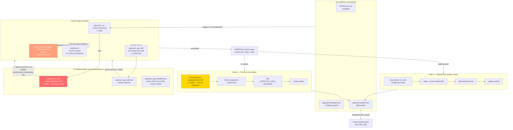

# Architecture — The Approach
*Generated by tech-lead-review · 2026-05-16*

## Data and Token Flow

## Token Cost Table

| Operation | Cost | Frequency | Notes |
|---|---|---|---|
| `approach_run` (current) | ~15KB / ~4K tokens | Every trigger | 🔴 Should be ~0.5KB |
| `approach_run` (target) | ~0.5KB / ~125 tokens | Every trigger | After fix |
| `approach_get_skill` per section | 1–15KB / 250–4K tokens | On demand | Schema section largest |
| WebSearch batch (×9 concurrent) | ~variable | Once per run | Correct — parallel |
| Path A edit cycle | ~50 tokens | Every repeat run | Correct — cheap |
| Path B template Read | ~131KB / ~33K tokens | First run only | ⚠ Verify Read limit |
| `approach_get_template` | ~131KB / ~33K tokens | Deprecated | Don't call in Cowork |

## Design Notes

**What's working:**
- Path A (repeat run) is now correct — targeted Grep → Read → Edit pattern avoids large responses entirely.
- Security injection patterns (replacer function, `</script>` escape) are correct in `approach_get_template`.
- `getApproachSkillSection` boundary map covers all 6 sections cleanly.

**Critical gap:**
- `approach_run` returns the full SKILL.md (current state). This should be orchestration instructions only, with agents calling `approach_get_skill` per section as needed. This is the architectural mismatch between The Approach and The Warmup/Spotter.

**Render section boundary bug:**
- `render` section boundary ends at `## Summary line`, excluding it. Agents loading only `section:"render"` will silently skip the summary line output. Extend boundary to `## Editorial rules`.

**Path B:**
- Reads 131KB template via file Read tool. Whether this triggers Cowork's large-response offload behavior is unverified. Test before declaring it fixed.
