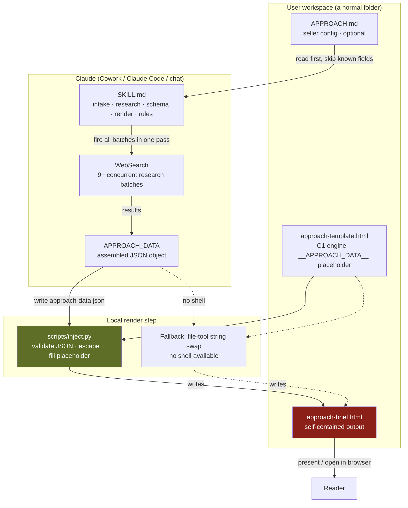

# Architecture — The Approach (self-contained edition · v0.3.1)

The Approach is a **fully local skill**. There is no Cloudflare Worker, no MCP
server, no KV store, and no network dependency beyond the web research itself.
A run reads a config file, fires research searches, assembles one JSON object,
and renders a self-contained HTML brief by injecting that JSON into a bundled
template. The output opens in any browser.

This replaces the earlier MCP edition, where `approach_run` / `approach_get_skill`
/ `approach_get_template` ran on `mcp.missionbuilt.io` and the agent juggled a
Path A / Path B split against a live Cowork artifact. None of that exists here.

## Data and control flow

## The render contract

The template carries the entire engine — CSS, layout, renderer, scroll spy,
toolbar/export — plus a single placeholder: `__APPROACH_DATA__`. The agent never
writes HTML. It assembles `APPROACH_DATA` and lets the template render it.

`scripts/inject.py` replicates the two safety layers the old server-side tool
enforced:

1. **`</script>` escaping** — any `</script>` inside intel text is rewritten to
   `<\/script>` so research content cannot break out of the data `<script>` block.
2. **Literal placeholder replacement** — Python `str.replace` has no `$`-expansion
   semantics, so `$&`, `$'`, `` $` `` and backslashes in the data are safe by
   construction. (This is the bug the MCP edition hit with JS `String.replace`
   and a literal replacement string; it cannot recur here.)

The script exits non-zero with a specific message on invalid JSON (exit 2) or a
missing placeholder (exit 3), so failures are loud, not silent.

A documented file-tool fallback (read template → swap the literal token → write
output) covers chat-only environments with no shell. It performs the same two
safety steps by hand.

## Cost profile

| Operation | Cost | Frequency | Notes |
|---|---|---|---|
| Load `SKILL.md` | ~24KB once | Per run | Single file; no per-section MCP round trips |
| WebSearch batches (×9 + per-contact) | variable | Once per run | Fired concurrently in one pass |
| Read `approach-template.html` | ~40KB | Only the build step touches it | Read by `inject.py`, not by the agent |
| `inject.py` render | negligible | Once per run | Local; no tokens, no network |

There is no repeat-run "Path A" edit cycle and no large-template Read in the
agent's context: every run simply rebuilds `approach-brief.html` from template +
fresh data. A correction (no new searches) edits `approach-data.json` and re-runs
the injection.

## Fonts

Oswald, Merriweather, and JetBrains Mono load from the Google Fonts CDN via a
`<link>` in the template head, with a system-font stack as fallback. On a
locked-down network the brief renders in fallback fonts and is fully readable.
(The Warmup bakes its fonts in as base64; The Approach intentionally does not,
keeping the template small — the design degrades gracefully instead.)

## What is NOT in this architecture

- No Cloudflare Worker, no `mcp.missionbuilt.io` endpoint.
- No `approach_run` / `approach_get_skill` / `approach_get_template` MCP tools.
- No `update_artifact` / `create_artifact` Path A vs Path B branching.
- No MCP font loader, no `config.fontToolName`, no `window.cowork` bridge.
- No remote shell, no engine-version check, no chunk stitching.

## Version history

| Version | Change |
|---|---|
| 2026-05-16 | Original tech-lead-review diagram — MCP/Worker architecture, Path A/B, `approach_get_template`. |
| 0.3.1 | Rewritten for the self-contained edition. Worker + MCP tools removed; render is `scripts/inject.py` against the bundled template; fonts via CDN with system fallback. No server dependency anywhere. |
